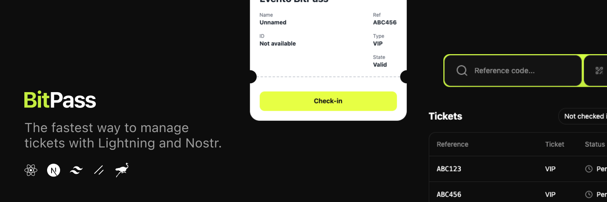

# BitPass



**BitPass** is a ticketing platform that allows event organizers to create events, sell tickets, and manage check-ins using Bitcoin Lightning Network and Nostr technology.

## ✅ Features

- [x] **Responsive Design**: Works on desktop and mobile devices
- [x] **Event Management**: Create and manage events with customizable details
- [x] **Ticket Sales**: Sell tickets with Bitcoin Lightning Network payments

## 🚀 Soon
- [ ] **Check-in System**: Scan QR codes or manually enter ticket references
- [ ] **Discount Codes**: Create and manage discount codes for your events
- [ ] **Team Management**: Invite team members with different roles

## 🛠️ Technologies

- **Frontend**: Next.js 14, React, TypeScript, Tailwind CSS
- **State Management**: React Context
- **Authentication**: Email OTP and Nostr login
- **Styling**: Tailwind CSS with custom dark theme
- **Payment**: Lightning Network integration

## 🏁 Getting Started

### Prerequisites

- Node.js 18+ and npm/yarn
- Git

### Installation

This project uses [pnpm](https://pnpm.io/) to install dependencies and run scripts.

1. Clone the repository:
```bash
git clone https://github.com/bitpass-live/bitpass-app.git
cd bitpass-app
```

2. Install dependencies:
```bash
pnpm install
```

3. Run the development server:
```bash
pnpm dev
```

4. Open [http://localhost:3000](http://localhost:3000) in your browser.

## 🏗️ Project Structure

```
bitpass/
├── app/                  # Next.js App Router
│   ├── checkin/          # Check-in page
│   ├── login/            # Authentication pages
│   └── ...
├── components/           # React components
│   ├── auth/             # Authentication components
│   ├── check-in/         # Check-in components
│   └── ui/               # UI components
├── hooks/                # Custom React hooks
├── lib/                  # Utility functions and hooks
└── public/               # Static assets
```

## 🎨 Design System

BitPass uses a dark-themed design system with the following color palette:

- **Primary**: Fluor Yellow (#D8FF00)
- **Background**: Dark Black (#0A0A0A)
- **Surface**: Medium Black (#121212)
- **Muted**: Dark Gray (#1A1A1A)
- **Border**: Border Gray (#2A2A2A)
- **Foreground**: White (#FFFFFF)
- **Muted Foreground**: Secondary Text (#9E9E9E)

## 🤝 Contributing

Contributions are welcome! Please feel free to submit a Pull Request.

1. Fork the repository
2. Create your feature branch (`git checkout -b feature/amazing-feature`)
3. Commit your changes (`git commit -m 'Add some amazing feature'`)
4. Push to the branch (`git push origin feature/amazing-feature`)
5. Open a Pull Request

## 📄 License

This project is licensed under the MIT License - see the LICENSE file for details.

## 💌 Contact

If you have any questions or concerns about **BitPass**, please contact the developer at [npub1em3g0wcfjz5we0gaaelw07fcyqys3fwg42qykw774mvgala424rsl26ytm](https://njump.me/npub1em3g0wcfjz5we0gaaelw07fcyqys3fwg42qykw774mvgala424rsl26ytm).
